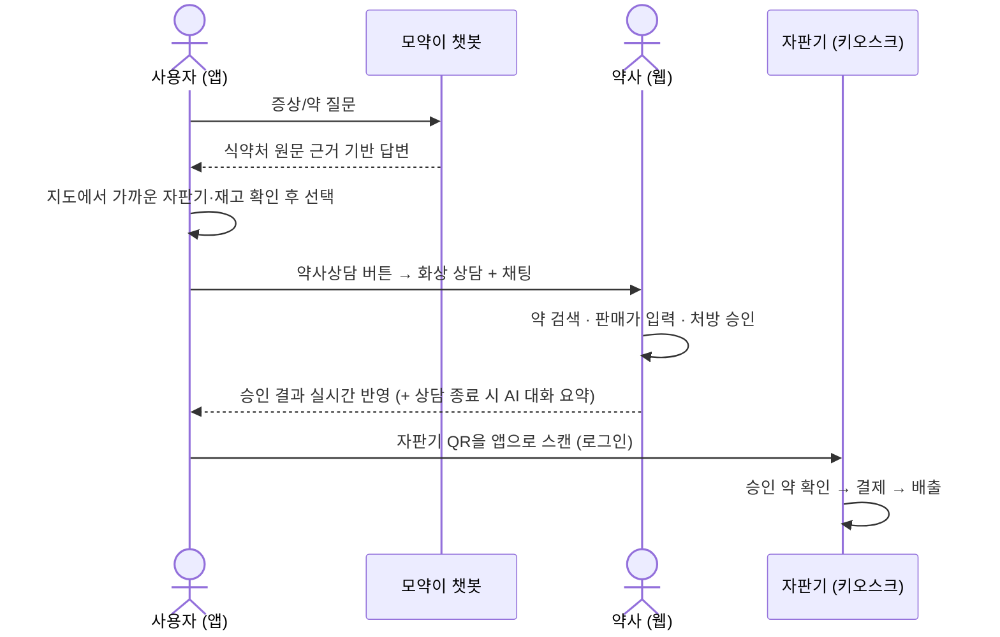

# MOYAK 모약 — 스마트 의약품 자판기 서비스

**MOYAK(모두의 약)** 은 AI 챗봇 상담 → 약사 화상 상담·처방 승인 → 자판기 수령까지 이어지는 스마트 의약품 자판기 서비스입니다.
이 저장소는 그 백엔드(FastAPI)와 시연용 웹 화면 3종(사용자 앱 · 약사 웹 · 자판기 키오스크)을 담고 있습니다.

> **핵심 원칙 — AI는 판매를 승인하지 않습니다.**
> 챗봇은 공식 자료(식약처 e약은요) 안에서만 안내하고, 어떤 약을 줄지는 항상 약사가 상담 후 직접 정해 승인합니다.
> 모든 승인·결제·수령 기록이 DB에 남습니다. (규제샌드박스 신청 근거 자료용 프로토타입)

## 🔗 바로 보기 (Render 배포)

| 화면 | 주소 | 설명 |
|---|---|---|
| 📱 사용자 앱 | https://moyak-backend.onrender.com | 스플래시부터 시작 (`/app/...`) |
| 🩺 약사 웹 | https://moyak-backend.onrender.com/pharmacist | 상담 대기 목록, 채팅, 처방 승인 |
| 🖥️ 자판기 키오스크 | https://moyak-backend.onrender.com/kiosk/start/ | 세로형 대형 터치스크린 (1080×1920) |
| 🧪 챗봇 테스트 | https://moyak-backend.onrender.com/chat-test | 답변/출처/원문 근거 확인용 |
| 📖 API 문서 | https://moyak-backend.onrender.com/docs | Swagger |

> Render 무료 인스턴스라 한동안 안 쓰면 첫 접속에 ~1분 걸리고, 재배포 시 상담/결제 기록(SQLite)이 초기화됩니다.
> 모든 화면은 폰·PC 어느 크기에서도 화면에 맞게 축소되어 보입니다.

## 🎬 전체 시나리오



## ✨ 주요 기능

### 📱 사용자 앱 (`/app`)
- **모약이 챗봇 (RAG)**: e약은요 공공데이터 안에서만 답변하고, 실제 인용한 **식약처 원문**을 "근거 보기"로 그대로 보여줍니다.
  - 특정 약 질문 / **증상 기반 추천**(추천 이유·복용법·주의사항) / **병용 안전성 확인**(명시 안 됨 ≠ 안전) /
    **임산부·소아·고령자 필터** / 후속 질문 맥락 유지 / 위험 질문 시 약사 상담 권유
- **약사 화상 상담**: 하단 가운데 "상담하기" 버튼으로 챗봇 대화 없이 바로 입장, 또는 챗봇 대화 내용을 약사에게 전달하며 요청
  - 화상(Daily.co) 중 **💬 채팅**, 상담 종료 시 **AI 대화 요약**(대화에 없는 정보는 만들지 않음)
  - 약사 승인/거절 결과가 3초 간격으로 자동 반영
- **내 주변 자판기 지도**: 카카오 지도 + 가까운 순 목록(거리·도보 시간·재고 상태) → 자판기별 품목 재고 → 자판기 선택
- **전자 구매 허가서**(마이페이지), 온보딩/회원가입/권한 안내 화면 (Figma 디자인 기반)

### 🩺 약사 웹 (`/pharmacist`)
- 상담 대기 목록 (챗봇 대화 기록 또는 "직접 상담 요청" 표시) + 🎥 화상 상담 입장
- 환자와 실시간 채팅, **상담 종료 및 대화 요약**
- 처방할 약 **자동완성 검색**(e약은요 4,757개 품목) + **판매가 입력** → 승인/거절(사유) — 처리 내역 탭

### 🖥️ 자판기 키오스크 (`/kiosk`)
- 시작 → 회원 QR 로그인(앱으로 스캔) 또는 비회원 의약외품 구매
- **회원**: 승인받은 약이 있으면 승인 약 확인(장바구니) → 결제 → 배출, 없으면 안내 홈
- **비회원**: 의약외품 목록 → 장바구니(수량/삭제) → 결제 → 배출
- 결제 완료 시 자동 로그아웃, 10분 무조작 시 장바구니 초기화/로그아웃 (공용 기기 보안)

## 🛠 기술 스택

| 영역 | 기술 |
|---|---|
| 데이터 소스 | 식약처 e약은요 공공데이터 API |
| 전처리 | Python + Pandas |
| 임베딩 / 벡터 DB | OpenAI `text-embedding-3-small` / Pinecone (1536, cosine) |
| LLM | GPT-4o (temperature 0.2), 질문 분류·재작성·상담 요약은 GPT-4o-mini |
| 체인 | LangChain |
| API 서버 | FastAPI (+ slowapi 요청량 제한) |
| 상담/결제/키오스크 DB | SQLite (SQLAlchemy, `DATABASE_URL`로 Postgres 교체 가능) |
| 자판기 위치/재고 | Supabase (PostgreSQL + PostGIS), 읽기 전용 조회 |
| 지도 | 카카오 지도 JavaScript API |
| 화상 상담 | Daily.co (Prebuilt) |
| 프론트 (시연용) | Figma → HTML/CSS 내보내기 + Vanilla JS |
| 배포 | Render (`master` 브랜치 푸시 시 자동 배포) |

## 🧠 RAG 데이터 파이프라인

```
STEP 0 수집 → STEP 1 정제 → STEP 2 청킹 → STEP 3 임베딩 → STEP 4 인덱싱(Pinecone)
                                                                    │
                                        STEP 6 API 서버 ← STEP 5 RAG 체인
```

| STEP | 내용 | 결과 |
|---|---|---|
| 0 | e약은요 API 전체 수집 | 4,774건 |
| 1 | HTML 제거, 중복/결측 처리 | 4,757건 |
| 2 | 필드별(효능/사용법/경고/주의사항/상호작용/부작용/보관법) 청킹 | 27,956개 청크 |
| 3 | OpenAI 임베딩 | 27,956개 벡터 |
| 4 | Pinecone upsert | 인덱스 `moyak-eyakeunyo` |
| 5 | 질문 유형 분기(특정 약/증상/병용) + 검색 + GPT-4o 생성 | `src/rag/chain.py` |

## 📡 API 요약

전체 스펙은 `/docs`(Swagger)와 [`CLAUDE.md`](./CLAUDE.md) 참고. 프론트-백엔드 통신은 모두 JSON.

| 분류 | 엔드포인트 |
|---|---|
| 챗봇 | `POST /chat` (`question`, `history`) → `answer`, `sources`, `evidence` · IP당 15회/분, 200회/일 |
| 상담 | `POST /consultations` · `GET /consultations?status=&user_id=&pharmacist_id=` · `GET /consultations/{id}` · `POST /consultations/{id}/cancel` |
| 약사 결정 | `POST /consultations/{id}/decision` (`approve`, `drug_item_seq`, `drug_item_name`, `price`, `reason`) |
| 상담 채팅/요약 | `GET·POST /consultations/{id}/messages` · `POST /consultations/{id}/end` (AI 요약) |
| 약품 검색 | `GET /drugs/search?q=` (약사 자동완성) |
| 자판기 로그인 | `POST /vending/machines/{id}/rotate-qr` · `POST /vending/scan` · `GET /vending/machines/{id}/session` |
| 승인 약 | `GET /vending/purchases?user_id=` · `POST /vending/purchases/pay` · `POST /vending/dispense` |
| 의약외품 | `GET /vending/machines/{id}/products` · `POST /vending/machines/{id}/orders` · `GET /vending/orders/{id}` · `POST /vending/orders/{id}/pay` · `POST /vending/orders/{id}/dispense` |
| 지도 | `GET /api/v1/map/config` · `GET /api/v1/map/machines?lat=&lng=` · `GET /api/v1/map/machines/{id}` — [docs/map-api.md](./docs/map-api.md) |
| 기타 | `GET /health` |

## 🚀 로컬 실행

```bash
python -m venv .venv
.venv\Scripts\activate          # Windows
pip install -r requirements.txt
```

`.env.example`을 복사해 `.env`를 만들고 값을 채웁니다. **`.env`는 git에 올리지 않습니다.**

| 변수 | 용도 | 없으면 |
|---|---|---|
| `EYAK_SERVICE_KEY` | e약은요 데이터 수집 | 수집 스크립트만 불가 |
| `OPENAI_API_KEY` | 임베딩, 챗봇, 상담 요약 | 챗봇 불가 |
| `PINECONE_API_KEY` | 벡터 검색 | 챗봇 불가 |
| `DAILY_API_KEY` | 화상 상담방 생성 | 화상만 빠지고 상담은 동작 |
| `MAP_DATABASE_URL` | Supabase 자판기 위치/재고 (지도 전용, 읽기 전용) | 서버 DB의 시연용 가상 자판기 사용 |
| `KAKAO_JS_KEY` | 카카오 지도 (도메인 등록 필요) | 지도 대신 목록만 표시 |
| `DEMO_MAP_CENTER` | 지도 기본 중심 `위도,경도` | 동양미래대학교 |
| `DATABASE_URL` | 상담/결제/키오스크 DB | `data/moyak.db` (SQLite) |

> ⚠️ Supabase 주소는 반드시 `MAP_DATABASE_URL`에 넣으세요. `DATABASE_URL`에 넣으면 메인 서버가 시작되지 않습니다.

```bash
# 데이터 파이프라인 (최초 1회)
python src/ingestion/fetch_eyakeunyo.py   # STEP 0 수집
python src/ingestion/clean.py             # STEP 1 정제
python src/indexing/chunking.py           # STEP 2 청킹
python src/indexing/embedding.py          # STEP 3 임베딩 (비용 발생, 확인 프롬프트 있음)
python src/indexing/pinecone_index.py     # STEP 4 인덱싱

# 서버
python -m uvicorn src.api.main:app --reload
# → http://127.0.0.1:8000 (앱), /pharmacist, /kiosk/start/, /docs
```

## ✅ 테스트

```bash
pytest                              # 유닛 테스트 81건 — 외부 API 호출 없음
python tests/check_rag_quality.py   # RAG 답변 품질 셀프 체크 (실제 API 호출, 소액 비용, 수동 실행)
```

## 📁 폴더 구조

```
moyak-backend/
├── data/                    # raw/processed 데이터, SQLite DB — git 미포함
├── docs/map-api.md          # 지도 API 문서
├── scripts/
│   ├── build_drug_index.py          # 약사 자동완성용 약품 인덱스 생성
│   └── supabase_demo_machines.sql   # Supabase 시연용 자판기/재고 (동양미래대 주변)
├── src/
│   ├── config.py            # 환경변수
│   ├── ingestion/ indexing/ # STEP 0~4 데이터 파이프라인
│   ├── rag/                 # 프롬프트, RAG 체인
│   ├── consult/             # 상담·승인·결제·자판기 로직, 채팅 요약, 화상방, 가상 자판기 시드
│   ├── map_database.py      # Supabase 연결
│   └── api/
│       ├── main.py          # FastAPI 진입점 (map_app.py: 지도 단독 서버)
│       ├── routes/          # chat, consultation, drugs, vending, shop, map
│       └── static/          # app/(사용자 앱 20개 화면), kiosk/(13개 화면), pharmacist.html
└── tests/
```

## ⚠️ 아직 프로토타입인 부분

| 항목 | 현재 | 실제 서비스 전 필요 |
|---|---|---|
| 사용자/약사 인증 | 브라우저 임시 ID, 약사 ID 직접 입력 | 실제 로그인·본인인증 |
| 결제 | 모의 결제 (버튼으로 완료 처리) | PG사 카드/간편결제 연동 |
| 자판기 하드웨어 | 배출 성공 응답만 반환 | MQTT로 실제 자판기 제어 |
| 화상 상담 | Daily.co 기본 UI, 상담 요약은 채팅 기준 (음성 미포함) | 자체 통화 UI, 음성 전사 |
| 자판기 위치 | 시연용 가상 자판기 (동양미래대 주변) | 실제 설치 자판기 데이터 |
| DB | Render 무료 디스크(재배포 시 초기화) | Postgres 등 영속 DB |
| 회원 이름 | "회원 님" 고정 표시 | 인증 연동 후 실명 |

## 🗺 로드맵

1. ✅ 단일 약품 정보 조회 · 병용 안전성 확인 · 증상 기반 추천 · 특수 대상자 필터
2. ✅ 약사 화상 상담 → 처방 승인 → 자판기 QR 로그인 → 결제 → 수령 (프로토타입)
3. ✅ 상담 중 채팅 + AI 상담 요약
4. ✅ 자판기 지도 · 재고 조회 (Supabase + 카카오 지도)
5. ⏳ 실제 인증 · 결제 · 자판기 하드웨어(MQTT) 연동
6. ⏳ 사진 기반(멀티모달) 약 식별

## 👥 기여

- 지도 API(Supabase PostGIS 조회) 최초 구현: 한별 (`hanbyeol` 브랜치)

---

📱 **Flutter 앱 개발 인수인계(화면별 명세)**: [docs/flutter-handoff.md](./docs/flutter-handoff.md)

개발 배경, 상세 설계 원칙, API 스펙 변경 이력은 [`CLAUDE.md`](./CLAUDE.md)를 참고하세요.
