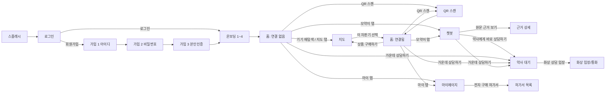
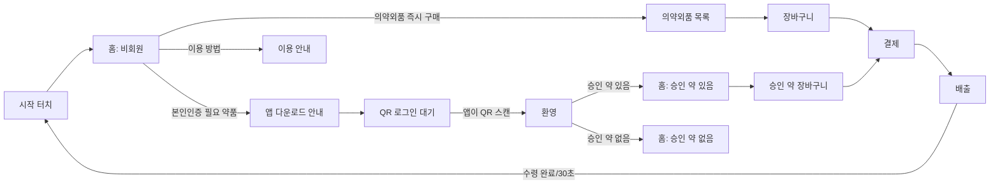

# MOYAK Flutter 개발 인수인계 문서

웹(HTML/CSS)으로 만든 **소비자 앱**과 **키오스크**를 Flutter 앱으로 옮기기 위한 화면별 명세입니다.
이 문서 하나로 "어떤 화면을, 어떤 디자인으로, 어떤 API를 불러서, 어떻게 동작하게 만들면 되는지"를 알 수 있게 정리했습니다.
(작성: 2026-10-09, 기준 커밋: `master`)

## 0. 한눈에 보기

| 구분 | 이번에 할 일 | 비고 |
|---|---|---|
| 📱 소비자 앱 (19개 화면) | **Flutter로 새로 만듦** (안드로이드폰) | 디자인 기준 402 × 874 |
| 🖥️ 키오스크 (13개 화면) | **Flutter로 새로 만듦** (세로형 대형 터치스크린) | 디자인 기준 1080 × 1920 |
| 🩺 약사 페이지 | 웹 그대로 (`/pharmacist`) | Flutter 대상 아님. 테스트할 때 같이 씀 |
| 서버 (FastAPI) | **그대로 사용** — 앱은 API만 호출 | 수정 필요 없음 |

- 서버 주소: `https://moyak-backend.onrender.com` (무료 서버라 한동안 안 쓰면 첫 요청이 ~1분 걸림 → 앱 로딩 화면 필요)
- API 문서(Swagger): `https://moyak-backend.onrender.com/docs`
- 지금 동작하는 웹 버전(동작 참고용): 소비자 앱 `https://moyak-backend.onrender.com`, 키오스크 `/kiosk/start/`, 약사 `/pharmacist`
- 원본 디자인(Figma): `https://www.figma.com/design/sCMmK2ZX5mLETL7eR3fjrL/MOYAK`

## 1. 디자인 자료가 있는 곳

- 소비자 앱: [`src/api/static/app/<화면>/`](../src/api/static/app) · 키오스크: [`src/api/static/kiosk/<화면>/`](../src/api/static/kiosk)
- 화면 폴더 하나 = `index.html`(구조 + `<script>` 안의 동작) + `style.css`(색·크기·간격 등 디자인 값) + 아이콘/이미지(`.svg`, `.png`)
- 이미지·아이콘은 그대로 Flutter `assets/`로 복사해서 쓰면 됨 (SVG는 `flutter_svg`)
- `style.css`는 Figma 내보내기라 **좌표 고정(absolute)** 이 많음 → Flutter에서는 값(색·폰트·간격·둥글기)만 참고하고 배치는 `Column/Row/Padding`으로 다시 잡는 걸 추천

### 공통 디자인 값 (소비자 앱)
| 용도 | 값 |
|---|---|
| 배경 | `#F2EBDD` |
| 본문 글자 | `#3E2723` |
| 보조 글자 | `#7D6D6A` |
| 포인트(노랑) | `#FFD54F` / 버튼 `#FFD970` |
| 진한 초록(상담) | `#176B5B` |
| 카드 | 흰색, 둥글기 20~24, 그림자 `rgba(62,39,35,0.08)` |
| 글꼴 | Gothic A1 (Bold/ExtraBold/Black) |

키오스크: 배경 `#FFFDE7`, 진한 갈색 `#593D0D`, 포인트 `#FFD54F`, 글꼴 Inter/Gothic 계열(각 `style.css` 참고).

## 2. 공통 규칙

- **통신**: 전부 JSON. 실패 시 서버가 `{"detail": "사람이 읽을 수 있는 한국어 메시지"}`를 줌 → 그대로 화면에 보여주면 됨. `429`는 요청 과다.
- **날짜**: 서버 시간은 UTC이고 끝에 `Z`가 없음 → `DateTime.parse(s + 'Z').toLocal()`로 변환.
- **사용자 ID (임시)**: 아직 로그인 기능이 없어서, 앱 첫 실행 때 UUID를 만들어 영구 저장(`moyak_user_id`)하고 모든 API에 `user_id`로 보냄. 로그인 API가 생기면 계정 ID로 교체 예정.
- **상태바**: 웹 디자인에 있는 가짜 "9:41" 상태바는 **앱에서는 만들지 말 것**(폰의 진짜 상태바 사용).
- **하단 네비바 (소비자 앱 공통)**: 메인 · 지도 · **가운데 상담하기(🩺)** · 모약이 · 마이
  - 메인 → 홈 (선택한 자판기가 있으면 "연결됨" 홈, 없으면 "연결 없음" 홈)
  - 지도 → 지도 화면 / 상담하기 → **챗봇 대화 없이 바로 약사 상담**(아래 "약사 대기" 화면의 direct 모드) / 모약이 → 챗봇 / 마이 → 마이페이지

### 웹 저장값 → Flutter 대응
| 웹 키 | 웹 저장 위치 | 의미 | Flutter에서 |
|---|---|---|---|
| `moyak_user_id` | localStorage(영구) | 임시 사용자 ID | `shared_preferences` |
| `moyak_selected_machine` | sessionStorage(이번 실행만) | 지도에서 고른 자판기 `{id, name, address}` | **앱 메모리 상태**(앱 껐다 켜면 초기화 — 의도된 동작) |
| `moyak_pending_chat_summary` | sessionStorage | 챗봇 대화를 약사에게 넘길 요약 | 화면 이동 인자로 전달 |
| `moyak_consultation_id`, `moyak_video_room_url` | sessionStorage | 진행 중인 상담 ID / 화상방 주소 | 앱 상태(상담 화면들끼리 공유) |
| `moyak_last_evidence` | sessionStorage | 근거 보기로 넘길 답변 데이터 | 화면 이동 인자로 전달 |

## 3. 소비자 앱 화면 흐름

## 4. 소비자 앱 화면별 명세

> 표기: `GET /경로` = 호출하는 API. "→ 화면" = 이동.

### 4-1. 스플래시 `app/splash`
- 1.8초 후 → 로그인
- **선택한 자판기 초기화** (앱을 새로 켜면 항상 "연결 없음"에서 시작)
- (추천) 이때 `GET /health`를 미리 불러 서버를 깨워두기

### 4-2. 로그인 `app/login`
- 지금은 **실제 인증 없음**: 로그인 버튼 → 임시 사용자 ID가 없으면 만들고 → 온보딩 1
- "회원가입" → 가입 1단계
- 로그인 API는 아직 없음(서버에 추가 예정). 화면만 먼저 만들어 두면 됨

### 4-3~5. 회원가입 1/3·2/3·3/3 `app/signup-step1~3`
- 1단계: 아이디 입력 + 중복확인(지금은 화면만) → 2단계 (입력한 아이디를 다음 단계로 전달)
- 2단계: 비밀번호 + 확인, 규칙 "영문·숫자·특수문자 조합 8자 이상" 표시, 일치 여부 표시 → 3단계
- 3단계: 본인 인증 방식 선택(이메일 인증 / 간편인증) → 완료 → 온보딩 1
- **서버 API 아직 없음** (가입·중복확인·로그인 추가 예정 — 추가되면 이 문서 갱신)

### 4-6. 온보딩 1~4 `app/onboarding-1~4`
- 다음 → 다음 장, 건너뛰기/마지막 → 홈(연결 없음). 서버 호출 없음

### 4-7. 홈: 연결 없음 `app/main-home-disconnected`
- 선택한 자판기가 있으면 즉시 → 홈(연결됨)
- "기기 재탐색" → 지도 / 오른쪽 위 "QR 스캔" → QR 스캔 화면

### 4-8. 홈: 연결됨 `app/main-home-connected`
- 선택한 자판기가 없으면 → 홈(연결 없음)
- 배지: "{자판기 이름에서 '모약 자판기 ' 뺀 이름} 자판기 연동됨"
- "상품 구매하기" → 지도 화면에서 **그 자판기 상세를 바로 열기**(`machine` 인자)
- 오른쪽 위 "QR 스캔" → QR 스캔

### 4-9. 지도 `app/map-screen` ⭐
- 처음에 `GET /api/v1/map/config` → `{kakao_js_key, default_center:{latitude, longitude}}` (기본 중심 = 동양미래대학교)
  - 앱에서는 카카오 지도 Flutter 플러그인 사용 → **카카오 개발자 콘솔에 안드로이드 플랫폼(패키지명·키 해시) 등록 필요**
- 위치 권한으로 내 위치 획득(실패/거부 시 기본 중심 사용)
- `GET /api/v1/map/machines?lat=&lng=` → `items[]`: `id, code, name, address, latitude, longitude, operating_hours, item_count, stock_count, distance_m` (서버가 가까운 순 정렬)
- **표시 규칙**
  - 거리·정렬은 **항상 실제 내 위치 기준**
  - 가장 가까운 자판기가 5km보다 멀면: 지도는 그 자판기 주변을 보여주고 상단 문구 "가장 가까운 자판기(이름)까지 N km"
  - 처음 지도 범위 = 보여줄 지역 3km 이내 자판기들 (너무 확대되지 않게 동네 단위 이상 유지)
  - 거리 표기: 1km 미만 `350m · 도보 5분`, 2km 미만 `1.2km · 도보 18분`(분당 67m), 그 이상 `6.1km`(도보 시간 없음)
  - 재고 배지: 0 → "품절", 10 미만 → "재고 적음", 그 외 "재고 있음"
  - 지도 핀은 **목록과 같은 번호만**(이름 쓰면 겹침), 상세를 연 자판기 핀만 이름까지 표시
- 목록/핀 클릭 → 상세: `GET /api/v1/map/machines/{id}?lat=&lng=` → 기본 정보 + `items[]: item_seq, item_name, stock, price, category`
  - "길찾기": `https://map.kakao.com/link/to/{이름},{위도},{경도}` 외부로 열기
  - **"이 자판기 선택"** → 선택 자판기 `{id, name, address}` 저장 → 홈(연결됨)
  - 이미 선택된 자판기면 "선택됨 ✓ · 선택 해제"

### 4-10. QR 스캔 `app/qr-camera`
- 뒤 카메라로 QR 인식 (Flutter: `mobile_scanner` 추천)
- 자판기 QR 내용은 JSON: `{"machine_id": "...", "qr_token": "..."}` (JSON이 아니면 "자판기 QR이 아닙니다" → 1.5초 후 다시 스캔)
- `POST /vending/scan` `{machine_id, qr_token, user_id}` → `{has_pending_purchase, purchase}`
  - 성공: "✅ 연동 완료!" + 승인된 약이 있으면 "승인된 약품(약 이름)을 자판기에서 수령하실 수 있어요." → 1.8초 후 홈(연결됨)
  - 실패(토큰 만료 등): 서버 메시지 표시 → 2초 후 다시 스캔
- 스캔이 성공하면 **키오스크 화면이 2초 안에 자동으로 로그인 화면으로 바뀜**(키오스크가 서버를 확인하는 구조)

### 4-11. 챗봇(모약이) `app/chatbot` ⭐
- `POST /chat` `{question, history:[{role:"user"|"assistant", content}]}` → `{answer, sources[], evidence[]}`
  - **history는 앱이 들고 있다가 매번 같이 보냄**(서버는 대화를 저장 안 함). 답을 받으면 질문/답을 history에 추가
  - 응답에 수 초 걸림 → "답변을 생성하는 중입니다..." 표시
  - 요청 제한: IP당 분당 15회·하루 200회(429)
- 답변 카드: `answer`의 `**굵게**`, `- 목록`, `1. 목록`을 서식으로 표시 / "참고 약품: sources 쉼표 연결" / 안전 문구 "정확한 진단과 복용은 약사와 상담하세요."
- `evidence`가 있으면 "원문 근거 보기 (개수)" → 근거 상세(질문·답변·sources·evidence 전달)
- 답변마다 "약사에게 바로 상담하기" → **지금까지 대화**를 `사용자: …` / `모약이: …` 줄로 이어 붙여 약사 대기 화면에 전달(아래 `chat_summary`)

### 4-12. 근거 상세 `app/evidence-detail`
- 챗봇에서 받은 데이터 표시. `evidence[]` 항목: `item_name, field, field_label, text`
- 필드 이름: efficacy 효능 · usage 사용법 · warning 경고 · precaution 주의사항 · interaction 상호작용 · side_effect 부작용 · storage 보관법
- 경고/주의사항/상호작용/부작용은 **주의 스타일**로 구분 표시. 서버 호출 없음

### 4-13. 약사 대기 `app/pharmacist-waiting` ⭐
- 진입 방식 2가지
  - **direct 모드**(하단 "상담하기"): 대화 요약 없이 상담 생성 → 화상방이 있으면 **바로 화상 입장 화면으로**(뒤로 오면 대기 화면)
  - 챗봇에서: 대화 요약을 넘겨 상담 생성, 대기 화면 표시
- 생성 전 중복 방지: `GET /consultations?status=pending&user_id=` → 있으면 그걸 재사용, 없으면 `POST /consultations` `{user_id, chat_summary?}`
- 응답 주요 필드: `id, status(pending|approved|rejected|cancelled), room_url, created_at, approved_drug_name, decision_reason, summary, ended_at`
- **3초마다** `GET /consultations/{id}` 로 상태 갱신
  - `approved`: "약사가 처방을 완료했어요", "처방약: …", 3단계 체크, 안내 "화상 상담이 끝났다면 자판기에서 QR을 스캔해 수령하세요", 취소 버튼 숨김
  - `rejected`: "상담이 거절되었어요" + 사유(없으면 "사유가 별도로 전달되지 않았습니다."), 버튼 "챗봇으로 돌아가기"
  - `cancelled` → 챗봇으로
  - `summary`가 생기면 "📝 상담 요약" 카드 표시 + 입장 버튼 숨김. `ended_at`이 생기거나 취소되면 갱신 중단
- 경과 시간 타이머(1초), 취소: `POST /consultations/{id}/cancel`
- `room_url`이 있으면 "🎥 화상 상담 입장하기" 버튼(약사 승인 전에도 입장 가능)
- **약사 입장 알림**: 3초마다 `GET /consultations/{id}/presence` → `{available, participants, pharmacist_in_room}`
  - `pharmacist_in_room`이 false→true가 되는 순간: 상단 배너 "약사가 화상 상담에 들어왔어요 / 지금 입장하면 바로 상담을 시작할 수 있어요 [지금 입장하기]" + 알림음 + 진동, 입장 버튼 문구 "🔔 약사가 들어왔어요 — 지금 입장하기", 3단계 문구 "약사가 화상 상담방에서 기다리고 있어요"
  - true→false: 배너 내리고 원래대로. `available:false`면 알림만 생략
  - (앱 장점) 앱을 꺼둔 상태 알림은 FCM 푸시로 추후 확장 가능

### 4-14. 화상 입장 / 통화 `app/video-consult-entry` ⭐
- 입장 전: 카메라 미리보기, 카메라/마이크 켜기·끄기, 스피커 테스트음. 약사 입장 알림(위와 동일, 배지 "약사 입장 완료")
- "입장하기" → `room_url`(Daily.co 화상방)을 화면에 띄움
  - **추천: 웹뷰(`webview_flutter`/`flutter_inappwebview`)로 room_url을 그대로 띄우기** — 카메라·마이크 권한을 웹뷰에 넘겨주는 설정 필요. (Daily 공식 Flutter SDK로 자체 통화 UI도 가능하지만 시간이 큼)
- 통화 중 아래 버튼: **💬 채팅**(안 읽은 개수 배지) / **상담 종료**
  - 채팅: 3초마다 `GET /consultations/{id}/messages` → `[{id, sender_role(user|pharmacist), sender_id, content, created_at}]` (id로 중복 제거하며 추가) / 보내기 `POST /consultations/{id}/messages` `{sender_role:"user", sender_id:user_id, content}` (1000자 이하, 종료된 상담엔 409)
  - 상담 종료: 확인 후 `POST /consultations/{id}/end` → 응답 `summary`로 **요약 화면** 표시("상담 결과 화면으로" → 약사 대기). 약사가 먼저 종료해도 3초 갱신에서 `summary`가 보이면 요약 화면으로 전환
  - 요약은 GPT가 대화(채팅+챗봇 대화+처방 결과)만으로 작성, 음성 내용은 포함 안 됨(요약 끝에 안내 문구 있음)

### 4-15. 마이페이지 `app/mypage`
- 아직 대부분 정적: "게스트 사용자", 결제수단 없음 안내
- "전자 구매 허가서" → 허가서 목록 / "로그아웃" → 임시 사용자 ID 삭제 → 로그인
- ⚠️ "재고 신청하기"는 웹에서도 **화면이 없음**(`/app/inventory-request/` 미구현) — 기획 확정 전까지 비활성 처리 추천

### 4-16. 전자 구매 허가서 `app/permit-list`
- `GET /vending/purchases?user_id=` → `[{drug_item_name, status, created_at, expires_at, approved_by, price, paid_at, …}]`
- 상태 라벨: pending "사용 가능" · expired "기간 만료" · dispensed "수령 완료" · cancelled "취소됨" (사용 가능만 강조 테두리)
- 카드: 약 이름, 상태, 유효기간 `발급일 ~ 만료일`(YYYY.MM.DD), 발급 약사. 없으면 "아직 발급된 전자 구매 허가서가 없습니다…"

## 5. 키오스크 화면 흐름

- 자판기 ID: 웹은 주소의 `?machine=` (기본 `M001`) → **앱에서는 설정값**(자판기마다 고정)
- 공용 기기라 **로그아웃 = `POST /vending/machines/{id}/rotate-qr`** (새 QR 발급 시 서버가 로그인 해제)

## 6. 키오스크 화면별 명세

| 화면 (`kiosk/…`) | 동작 / API |
|---|---|
| **start** 시작 | 화면 터치 → 홈(비회원) |
| **main-home** 홈(비회원) | 의약외품 즉시 구매 → 목록 / 본인인증 필요 약품 → 앱 다운로드 안내 / 이용 방법 → 안내 |
| **main-home-guide** 이용 안내 | 정적 안내, 돌아가기 → 홈 |
| **qr-download** 앱 다운로드 안내 | 앱 설치 안내 → 다음 → QR 로그인 대기 |
| **pairing** QR 로그인 대기 ⭐ | `POST /vending/machines/{id}/rotate-qr` → `{qr_token, qr_token_expires_at, qr_svg}` 로 **QR 표시**(앱에서는 `{"machine_id","qr_token"}` JSON을 `qr_flutter`로 직접 그려도 됨) · **55초마다 새 QR** · **2초마다** `GET /vending/machines/{id}/session` → `{paired, user_id, purchase}` 에서 `paired`가 true면 → 환영 |
| **welcome** 환영 | session 확인: 로그인 안 됐으면 안내 후 시작으로 / 됐으면 "회원님 환영합니다" → 2.5초 뒤(또는 터치) `purchase` 있으면 홈(승인 약 있음), 없으면 홈(승인 약 없음) |
| **main-home2** 홈(승인 약 있음) | `GET /vending/purchases?user_id=` 중 status pending 개수·첫 약 이름 표시("타이레놀 외 1건 터치해서 바로 받기") → 승인 약 장바구니 / 의약외품 → 목록 / 회원 로그아웃(rotate-qr → 시작) |
| **main-home3** 홈(승인 약 없음) | "승인받은 약이 없어요" · **5초마다** session 확인해 그 사이 승인되면 → main-home2 · 승인 필요한 메뉴는 앱 다운로드 안내로 |
| **otc-list** 의약외품 목록 | `GET /vending/machines/{id}/products` → `[{id, item_name, category, badge, price, stock}]` · 카테고리 탭 필터 · 담기/담김 토글 · 하단 담은 개수·합계 → 장바구니 |
| **cart** 장바구니(의약외품) | 수량 ± / 삭제 / 종류·총 개수·합계 · 결제하기: `POST /vending/machines/{id}/orders` `{items:[{product_id, quantity}]}` → 결제(order id) · **10분 무조작 시 장바구니 비우고 처음으로** |
| **cart2** 승인 약 장바구니 | 대기 중이고 미결제인 승인 건 목록(수량 1 고정, "승인받은 수량만 구매할 수 있어요") · ⓧ는 이번 수령에서만 제외 · 가격 있으면 결제로, 전부 가격 없으면 바로 배출로 · 10분 무조작 시 로그아웃 |
| **payment** 결제(모의) | 의약외품: `GET /vending/orders/{id}` 표시 → `POST /vending/orders/{id}/pay` · 승인 약: `POST /vending/purchases/pay` `{machine_id, purchase_ids}` (**결제 완료 시 서버가 자동 로그아웃**) → 배출 · 카드/모바일 결제 선택은 표시만(실결제 없음) · 회원 표시/로그아웃은 로그인 상태일 때만 |
| **dispensing** 배출 | 승인 약: 건마다 `POST /vending/dispense` `{purchase_id, machine_id}` / 의약외품: `POST /vending/orders/{id}/dispense` · 성공 시 "수령 약품: …", "하단 [1번 수령구]에서 약품을 꺼내주세요" · 실패 시 오류 표시 · "수령 완료" 또는 **30초 후** 로그아웃(rotate-qr) → 시작 |

## 7. 추천 Flutter 패키지

| 용도 | 패키지 |
|---|---|
| HTTP | `dio` 또는 `http` |
| 영구 저장 | `shared_preferences` |
| 상태 관리 | `provider` 또는 `riverpod` |
| SVG 아이콘 | `flutter_svg` |
| 카카오 지도 | `kakao_map_plugin` 등 (카카오 콘솔에 안드로이드 키 해시 등록) |
| 위치 | `geolocator` |
| QR 스캔(소비자) / QR 표시(키오스크) | `mobile_scanner` / `qr_flutter` |
| 화상 상담방 | `flutter_inappwebview` (카메라·마이크 권한 전달) |
| 알림음·진동 | `audioplayers`, `vibration` |
| 길찾기 외부 링크 | `url_launcher` |
| (추후) 푸시 알림 | `firebase_messaging` |

## 8. 아직 서버/기획이 없는 것 (앱에서 임시 처리)

- 회원가입·로그인·아이디 중복확인 API → 서버 추가 예정 (그 전엔 임시 사용자 ID)
- 실제 결제(PG), 실제 본인인증(PASS/토스), 자판기 하드웨어 제어(MQTT) → 모의 동작
- 마이페이지 "재고 신청하기" 화면 없음
- 서버 DB가 Render 무료 디스크라 재배포 시 상담·결제 기록 초기화 (Supabase 이전 예정)

API 스펙이 바뀌면 이 문서와 [`CLAUDE.md`](../CLAUDE.md)를 같이 갱신합니다.
